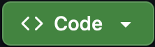
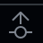

1. Click the  button above
2. Select the "Codespaces" tab
3. Click "Create Codespace on main" if you haven't created one before. Otherwise, click your Codespace's name
4. Wait for the Codespace to load
5. If a browser tab doesn't automatically open with the website preview, open the terminal ( button) in the upper left corner. Then, click the "Ports" tab. Right click the forwarded address and press "Open in Browser". You may need to allow popups
6. Make changes to the site from the [`docs/`](./docs/) folder & preview in that new tab. Repeat until satisfied with your change
7. Click the Git button on the left side of the IDE
8. Stage changes by pressing the "+" button
9. Write a commit message explaining your change in the "Message" box
10. Click the green "Commit" button
11. Push your changes to the repository to deploy to the production website by clicking the  button in the "Graph" section. Alternatively, reopen the terminal and type `git push`.