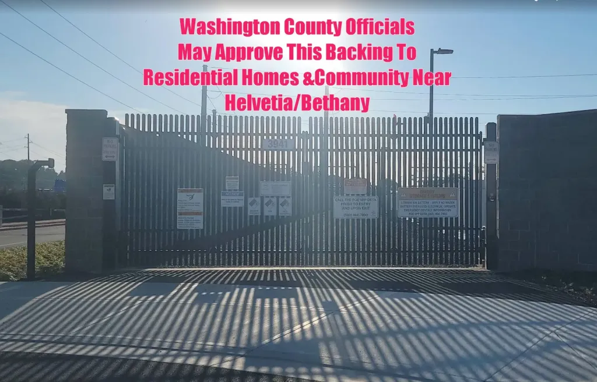
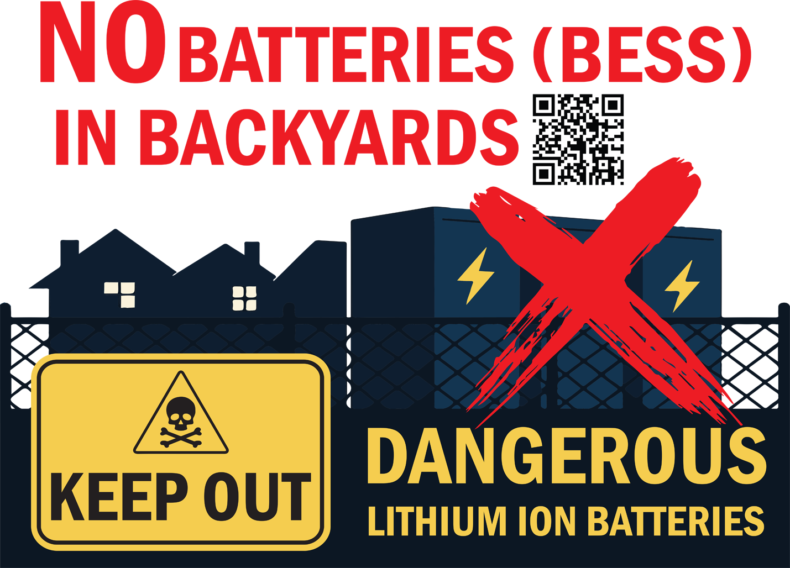
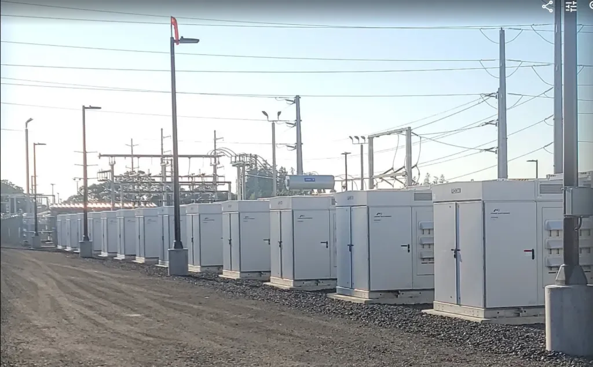
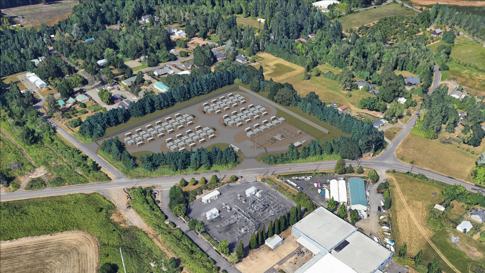

---
# Feel free to add content and custom Front Matter to this file.
# To modify the layout, see https://jekyllrb.com/docs/themes/#overriding-theme-defaults

# Send emails (Note: site.data.**email** should be replaced with the name of the YAML file in the ./_data directory):
# <a
#    href="mailto:{{ site.data.email.recipient | uri_escape }}?subject={{ site.data.email.subject | uri_escape }}&body={{ site.data.email.body | uri_escape }}"
#    class="email-btn">
# Email Sen. John Doe
# </a>

layout: default
title: Home
---

# Jupiter Power wants to build a 10-acre Battery Energy Storage System in our back yards! We need your help!

Jupiter Power and PGE are asking Washington County to approve construction of a large Battery Energy Storage System like the one pictured here in our NE Hillsboro neighborhood.  The output of the proposed BESS (100 mega-Watts) is approximately equivalent to 1000 Tesla car batteries, but they will be assembled on property that is currently farm land.  If approved, this development will bring light polution, constant noise, and increased risk of fire into our peaceful residential area.  If this is allowed, where will the next one be built?

## Please stand with us and tell Washington County this doesn't belong in anyone's back yard!  <u>Scroll down</u> to read about what a BESS is, why you should care, and what you can do to speak out for safe energy in Washington County!  Or <a href="faq"><u>click here</u></a> to jump to our FAQ page.

---

## What is a BESS?

A Battery Energy Storage System (BESS) is a battery array that stores energy from the electrial grid during off-peak hours, then returns the stored energy to the grid during peak usage times.

BESS facilities are typically situated in industrial zoned locations, but in Washington County, Oregon a BESS is being pushed into a residential/agriculture/farming neighborhood in NE Hillsboro — about 1/2 mile from Liberty HS and 1 mile from Lenox Elementary and West Union Elementary — without regard for the community.

We are **No Batteries in Backyards**, a grassroots movement uniting neighborhoods surrounding the proposed BESS location to stand up against this hazardous project. Together, we are demanding safe, responsible energy solutions that don’t put our community at risk.

---

## Why should I care?

- **Explosion and fire risks** from lithium-ion batteries threaten homes and lives.  
- **Toxic chemicals** released when lithium-ion batteries fail can poison air, water, and soil.  
- **Lack of community involvement** means residents are left in the dark about real dangers.  
- **The residential location selected** for this BESS project intensifies the community safety concerns.

<iframe style="width: 100%;" height="422" src="https://www.youtube.com/embed/6k4_b3H8Uhc" title="Fire at California power plant nearly under control after lithium batteries ignited" frameborder="0" allow="accelerometer; autoplay; clipboard-write; encrypted-media; gyroscope; picture-in-picture; web-share" referrerpolicy="strict-origin-when-cross-origin" allowfullscreen></iframe>

<iframe style="width: 100%;" height="422" src="https://www.youtube.com/embed/EuWMfG6RgK8" title="Jupiter Battery Storage In Hillsboro Threatens Local Residents" frameborder="0" allow="accelerometer; autoplay; clipboard-write; encrypted-media; gyroscope; picture-in-picture; web-share" referrerpolicy="strict-origin-when-cross-origin" allowfullscreen></iframe>

We refuse to accept unsafe energy storage in our neighborhoods. Clean energy must also be **safe energy**.

---

## What can I do about it?

- <b>Stay informed:</b> [<u>Read our news updates here</u>](/news)
- <b>Raise concerns:</b> Write to local leaders and elected officials to register complaints by clicking the buttons below
- <b>Show up:</b> Attend the public hearing on 10/30/2025 at 9:00am (Note community members who did not contact the County and/or submit public comments during the comment period may not be allowed to attend the hearing.  For more information, contact the Washington County Development Review/Current Planning office at 503-846-8761.)
- <b>Connect:</b> [<u>Email us to learn how to join the movement</u>](/contact)

### How to voice your concerns to local leaders and elected officials:

Click/tap the <u>Email</u> button below to open a pre-written message in your email app, read the message, sign your name, and send.  The email will not be sent until you click/tap the Send button.  Or click/tap the <u>PDF</u> button to download a PDF letter, print, sign your name, and send through postal mail.  Please note that your identity and activities on this website are <u>not</u> tracked or logged.

### Washington County Planners and Officials

<a
   href="mailto:{{ site.data.email_stephen_shane.recipient | uri_escape }}?subject={{ site.data.email_stephen_shane.subject | uri_escape }}&body={{ site.data.email_stephen_shane.body | uri_escape }}"
   class="email-btn"> 
Email
</a> <a
   href="./pdf/mail_stephen_shane.pdf"
   class="email-btn"> 
PDF
</a> -- **Stephen Shane, Principal Planner**

<a
   href="mailto:{{ site.data.email_maitreyee_sinha.recipient | uri_escape }}?subject={{ site.data.email_maitreyee_sinha.subject | uri_escape }}&body={{ site.data.email_maitreyee_sinha.body | uri_escape }}"
   class="email-btn">
Email
</a> <a
   href="./pdf/mail_maitreyee_sinha.pdf"
   class="email-btn"> 
PDF
</a> -- **Maitreyee Sinha, Senior Planner**

<a
   href="mailto:{{ site.data.email_stephen_roberts.recipient | uri_escape }}?subject={{ site.data.email_stephen_roberts.subject | uri_escape }}&body={{ site.data.email_stephen_roberts.body | uri_escape }}"
   class="email-btn">
Email
</a> <a
   href="./pdf/mail_stephen_roberts.pdf"
   class="email-btn"> 
PDF
</a> -- **Stephen Roberts, Land Use & Transportation Director**

<a
   href="mailto:{{ site.data.email_tanya_ange.recipient | uri_escape }}?subject={{ site.data.email_tanya_ange.subject | uri_escape }}&body={{ site.data.email_tanya_ange.body | uri_escape }}"
   class="email-btn">
Email
</a> <a
   href="./pdf/mail_tanya_ange.pdf"
   class="email-btn"> 
PDF
</a> -- **Tanya Ange, Washington County Administrator**

### Washington County Commissioners

<a
   href="mailto:{{ site.data.email_kathryn_harrington.recipient | uri_escape }}?subject={{ site.data.email_kathryn_harrington.subject | uri_escape }}&body={{ site.data.email_kathryn_harrington.body | uri_escape }}"
   class="email-btn">
Email
</a> <a
   href="./pdf/mail_kathryn_harrington.pdf"
   class="email-btn"> 
PDF
</a> --  **Kathryn Harrington, Washington County Commissioner At Large**

<a
   href="mailto:{{ site.data.email_nafisa_fai.recipient | uri_escape }}?subject={{ site.data.email_nafisa_fai.subject | uri_escape }}&body={{ site.data.email_nafisa_fai.body | uri_escape }}"
   class="email-btn">
Email
</a> <a
   href="./pdf/mail_nafisa_fai.pdf"
   class="email-btn"> 
PDF
</a> -- **Nafisa Fai, Washington County Commissioner District 1**

<a
   href="mailto:{{ site.data.email_pam_treece.recipient | uri_escape }}?subject={{ site.data.email_pam_treece.subject | uri_escape }}&body={{ site.data.email_pam_treece.body | uri_escape }}"
   class="email-btn">
Email
</a> <a
   href="./pdf/mail_pam_treece.pdf"
   class="email-btn"> 
PDF
</a> -- **Pam Treece, Washington County Commissioner District 2**

<a
   href="mailto:{{ site.data.email_jason_snider.recipient | uri_escape }}?subject={{ site.data.email_jason_snider.subject | uri_escape }}&body={{ site.data.email_jason_snider.body | uri_escape }}"
   class="email-btn">
Email
</a> <a
   href="./pdf/mail_jason_snider.pdf"
   class="email-btn"> 
PDF
</a> -- **Jason Snider, Washington County Commissioner District 3**

<a
   href="mailto:{{ site.data.email_jerry_willey.recipient | uri_escape }}?subject={{ site.data.email_jerry_willey.subject | uri_escape }}&body={{ site.data.email_jerry_willey.body | uri_escape }}"
   class="email-btn">
Email
</a> <a
   href="./pdf/mail_jerry_willey.pdf"
   class="email-btn"> 
PDF
</a> -- **Jerry Willey, Washington County Commissioner District 4**

### State Representatives

<a
   href="mailto:{{ site.data.email_nathan_sosa.recipient | uri_escape }}?subject={{ site.data.email_nathan_sosa.subject | uri_escape }}&body={{ site.data.email_nathan_sosa.body | uri_escape }}"
   class="email-btn">
Email
</a> <a
   href="./pdf/mail_nathan_sosa.pdf"
   class="email-btn"> 
PDF
</a> -- **Representative Nathan Sosa**

<a
   href="mailto:{{ site.data.email_janeen_sollman.recipient | uri_escape }}?subject={{ site.data.email_janeen_sollman.subject | uri_escape }}&body={{ site.data.email_janeen_sollman.body | uri_escape }}"
   class="email-btn">
Email
</a> <a
   href="./pdf/mail_janeen_sollman.pdf"
   class="email-btn"> 
PDF
</a> -- **Senator Janeen Sollman**

<a
   href="mailto:{{ site.data.email_lisa_reynolds.recipient | uri_escape }}?subject={{ site.data.email_lisa_reynolds.subject | uri_escape }}&body={{ site.data.email_lisa_reynolds.body | uri_escape }}"
   class="email-btn">
Email
</a> <a
   href="./pdf/mail_lisa_reynolds.pdf"
   class="email-btn"> 
PDF
</a> -- **Senator Lisa Reynolds**

---

## Important Dates

- **10/30/2025** -- Type III public hearing at Washington County Land Use and Development

---

## Important Links
- [Link to Washington County casefile for the proposed BESS project](https://www.washingtoncountyor.gov/current-planning/frequently-discussed-development-applications#L2500161)
- [Local news stories about the proposed Hillsboro BESS project](news)
- [FAQ - Answers to common questions](faq)

---
