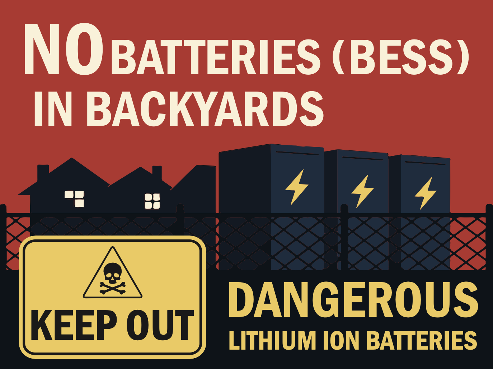

---
# Feel free to add content and custom Front Matter to this file.
# To modify the layout, see https://jekyllrb.com/docs/themes/#overriding-theme-defaults

layout: home
---

**Protect our homes. Protect our families. Protect our future.**

Battery Energy Storage System (BESS) facilities are being pushed into residential neighborhoods across the country — often without transparency, without safety assurances, and without regard for the people who live nearby.  

We are **No Batteries in Backyards**, a grassroots movement uniting neighbors to stand up against these hazardous projects. Together, we are demanding safe, responsible energy solutions that don’t put our communities at risk.

---

## Why This Matters

- **Explosion and fire risks** from lithium-ion batteries threaten homes and lives.  
- **Toxic chemicals** released in failures can poison air, water, and soil.  
- **Lack of oversight** means residents are left in the dark about real dangers.  

We refuse to accept unsafe energy storage in our neighborhoods. Clean energy must also be **safe energy**.

---

## Take Action

- Stay informed: [Read our updates](/updates)  
- Show up: Attend upcoming town hall and planning board meetings  
- Connect: [Join the movement](/contact)  

Together, we can stop hazardous BESS siting in our backyards — and build safer alternatives for a sustainable future.

---

## Recent Updates
